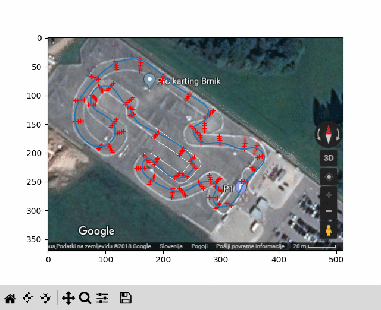

# Optimal Gokart Path Finder

[](https://opensource.org/licenses/MIT)
[](https://www.python.org/)
[](https://github.com/jprevc/optimal-gokart-path-finder/stargazers)
[](https://github.com/jprevc/optimal-gokart-path-finder/issues)
[](https://github.com/jprevc/optimal-gokart-path-finder/commits/master)

A tool that finds a near-optimal racing line for a go-kart on a user-defined track. The track is represented by border points; paths are interpolated with splines and evaluated using a simple physics model (acceleration, drag, and lateral grip). Two search algorithms are supported: a **Genetic Algorithm** and **Monte Carlo** random sampling.

---

## Description

The program:

1. Lets you define a track by clicking border points on a track image (or by loading saved points).
2. Discretizes the track into segments and samples waypoints along each segment.
3. Searches over path combinations via a **Genetic Algorithm** or **Monte Carlo** random sampling.
4. For each candidate path: builds a **smooth spline**, computes curvature and maximum cornering speed, then **simulates** lap time with a go-kart model.
5. Keeps the path with the **shortest simulated lap time** and optionally animates the kart driving along it.

### Physics model (brief)

- **Longitudinal:** Motor force `F_motor` vs quadratic drag `F_drag = k_drag * v^2`. Acceleration: `a = (F_motor - F_drag) / m`.
- **Lateral:** Max cornering speed at each point is limited by grip: `v_max = sqrt(F_grip * R / m)`, where `R` is the local radius of curvature from the path spline. The simulation never exceeds this speed on corners.

---

## Demo




---

## Installation

1. Clone the repository and enter the project directory:

   ```bash
   git clone <repo-url>
   cd optimal-gokart-path-finder
   ```

2. Install the package and dependencies with **uv**:

   ```bash 
   uv sync
   ```
---

## Usage

### Command-line interface (CLI)

Run the demo with the bundled track image and pre-selected points:

```bash
optimal-gokart --demo ga
```

Run on your own track image, selecting border points interactively:

```bash
optimal-gokart --track-image my_track.png --save-points my_points.npy ga
```

On subsequent runs, load the saved points directly:

```bash
optimal-gokart --track-image my_track.png --points-file my_points.npy ga
```

Run `optimal-gokart --help` for all available options.

### Interactive track definition

If no `--points-file` is given and the bundled default doesn't exist, the CLI opens the track image and asks you to **click border points**:

- Click in order along one border, then the other, so that consecutive pairs define line segments across the track.
- When finished, **click the middle mouse button (wheel)** to stop. Points are saved to `points.npy` in the current directory.
- The **first two clicked points** are used as a scale reference; they should correspond to a known distance on the track (e.g. 20 m) to set the pixel-to-metre ratio.

### What the CLI does

1. Loads the track image and border points (bundled defaults or user-supplied).
2. Runs the chosen algorithm (`ga` or `montecarlo`) to find the path with the **shortest simulated lap time**.
3. Redraws the plot whenever a better path is found.
4. Plays an **animation** of the go-kart driving the best path.

---

## Gokart parameters

You can tune the go-kart physics via CLI flags (`--gokart-mass`, `--gokart-f-grip`, `--gokart-f-motor`, `--gokart-k-drag`):

| Parameter   | Meaning                             | Unit     | Example / note           |
|-------------|-------------------------------------|----------|--------------------------|
| `mass`      | Total mass (kart + driver)          | kg       | e.g. 200                 |
| `f_grip`    | Lateral grip force (cornering)      | N        | Limits v_max in corners  |
| `f_motor`   | Motor thrust (forward force)        | N        | e.g. 2000                |
| `k_drag`    | Drag coefficient (F = k_drag * v^2) | N·s²/m²  | e.g. 0.6125              |

Higher `f_grip` allows higher cornering speed; higher `f_motor` and lower `k_drag` give higher straight-line speed.

---

## Algorithm overview

1. **Track representation**  
   Border points define line segments across the track. Each segment is discretized into `points_on_line` waypoints. A **path** is one waypoint chosen on each segment, in order.

2. **Path search**  
   Two algorithms are available:
   - **Genetic Algorithm (`ga`):** Evolves a population of paths over generations using selection, crossover, and mutation. Generally finds better paths given the same compute budget.
   - **Monte Carlo (`montecarlo`):** Samples random paths and keeps the one with the shortest lap time. Simpler but effective for a quick search.

3. **Spline interpolation**  
   The chosen waypoints are interpolated with a **smooth spline** (e.g. `scipy.interpolate.splprep` / `splev`). The spline gives:
   - interpolated positions,
   - derivatives for curvature,
   - and curvature-based **maximum cornering speed** at each point.

4. **Physics simulation**  
   Lap time is computed by stepping in time with a fixed `dt`:
   - Update speed: `v <- v + dt * a(v)`, with `a = (F_motor - k_drag * v^2) / m`.
   - Cap speed at the current point’s `v_max` (grip limit).
   - Advance position along the path based on \(v\) and path length.
   The simulation stops when the kart has completed one lap; total time is the lap time used for comparison.

5. **Visualization**  
   The best path is drawn on the track image, and `GokartDriveAnimation` replays the simulated positions as an animation.

---

## How it works (flowchart)

```text
┌─────────────────────────────────────────────────────────────────┐
│  Load track image & border points (click or load points.npy)    │
└───────────────────────────────┬─────────────────────────────────┘
                                ▼
┌─────────────────────────────────────────────────────────────────┐
│  Build Track: segments → waypoints per segment                  │
└───────────────────────────────┬─────────────────────────────────┘
                                ▼
┌─────────────────────────────────────────────────────────────────┐
│  Search loop (GA generations or Monte Carlo iterations)         │
│    ├─ Generate candidate path(s)                                │
│    ├─ Path → spline interpolation → curvature → v_max(s)        │
│    ├─ Simulate lap: integrate speed with motor/drag + grip cap  │
│    └─ If lap time < best so far → save path, redraw             │
└───────────────────────────────┬─────────────────────────────────┘
                                ▼
┌─────────────────────────────────────────────────────────────────┐
│  Show best path on image; animate go-kart along path            │
└─────────────────────────────────────────────────────────────────┘
```

---

## Project structure

```text
optimal-gokart-path-finder/
├── src/
│   └── optimal_gokart/
│       ├── __init__.py
│       ├── algorithms.py      # GeneticAlgorithmPathFinder, MonteCarloPathFinder
│       ├── cli.py             # optimal-gokart entry point
│       ├── models.py          # Gokart, Path, Track
│       ├── visualization.py   # GokartDriveAnimation
│       └── data/              # bundled track image and default points
├── tests/
│   ├── test_models.py
│   └── test_optimal_path_classes.py
├── pyproject.toml
├── uv.lock
└── README.md
```
